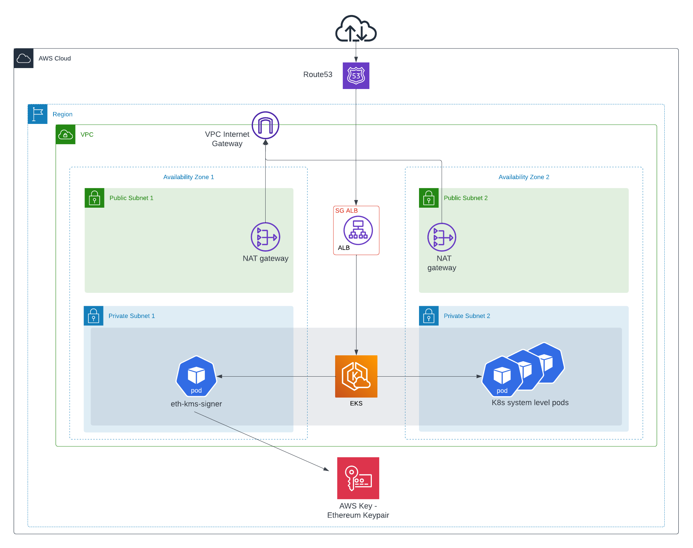

# expert-happiness

At high level, this repo provides an exemplary Ethereum faucet-like application on the Sepolia testnet with keypair management handled in AWS KMS.

The repo is broken down into four discrete directories - `aws`, `k8s`, `app`, and `eth-kms-signer` - each serving a different function in the application architecture:

- `aws`: Terraform stack and associated Terraform modules for deploying the underlying AWS infrastructure (e.g., VPC, EKS, KMS, etc.) for the application. 
- `k8s`: Terraform stack for Kubernetes system applications (e.g., ArgoCD, AWS Load Balancer Controller, External DNS, Grafana, Prometheus, etc.).
- `app`: Kubernetes manifests defining the Sepolia faucet-like application.
- `eth-kms-signer`: Fastify server (node.js) defining the application code.

Additionally, in `.github/workflows`, a GitHub Action is defined that produces Docker images of the `eth-kms-signer` code and pushes to AWS ECR for ultimate consumption in `app` on the EKS cluster.

## Usage

The Sepolia faucet-like application exposes two REST endpoints at the app.expert-happiness.com domain:

1. GET `/wallet`
  - E.g., `https://app.expert-happiness.com/wallet`
  - Returns the public key corresponding to the KMS-defined Ethereum keypair
2. POST `/send?address=<recipient>`
  - E.g., `curl -X POST "https://app.expert-happiness.com/send?address=0x16406c22b24Cd6e8f73DbdD131be89402796190D"`
  - Performs a faucet-like `0.0001` token transfer to the `<recipient>` address

## Architecture



As shown in the AWS architecture diagram above, there is a two-tier VPC structure with EKS operating in private subnets in support of the Sepolia faucet-like application. The application is exposed by an Application Load Balancer with domain defined in Route53 and SSL certificate managed in ACM. In addition to the application, provided at `https://app.expert-happiness.com`, the load balancer also provides ingress for Argo and Grafana consoles e.g., `https://argo.expert-happiness.com` and `https://grafana.expert-happiness.com`.

## Deployment

When using this repo to deploy the Sepolia faucet-like application, it is intended that a fork be created so that the resources can be tailored to a variety of implementations and custom variables can be set. After making a fork, the resources must be deployed in the following directory order based on the following high-level descriptions:

1. `aws`
  - Create S3 bucket for [Terraform remote backend](https://developer.hashicorp.com/terraform/language/settings/backends/s3)
  - Create `backend.tfvars` file with contents as shown below:

    ```txt
    bucket         = "<s3_bucket_name>"
    key            = "aws/terraform.tfstate" # or whatever prefix/key structure you want, just can't conflict with that of the k8s dir
    region         = "<aws_region>"
    use_lockfile   = true
    ```
  - Create `terraform.tfvars` file. An example file for a deployment aligned with the architecture diagram above is shown below:

    ```txt
    # VPC
    aws_region             = "us-east-1"
    aws_availability_zones = ["us-east-1a", "us-east-1b"]

    vpc_name       = "vpc"
    vpc_cidr_block = "10.0.0.0/16"

    public_subnets   = ["10.0.1.0/24", "10.0.2.0/24"]
    private_subnets  = ["10.0.101.0/24", "10.0.102.0/24"]

    public_subnet_tags = {
      "kubernetes.io/cluster/<insert-cluster-name>" = "shared"
      "kubernetes.io/role/elb"                      = 1
    }

    private_subnet_tags = {
      "kubernetes.io/cluster/<insert-cluster-name>" = "shared"
      "kubernetes.io/role/internal-elb"             = 1
    }

    # EKS
    eks_cluster_name    = <insert-cluster-name>
    eks_cluster_version = "1.33"

    eks_vpc_cni_version    = null
    eks_coredns_version    = null
    eks_kube_proxy_version = null
    eks_ebs_csi_version    = null

    node_group_max_size = 6

    eks_endpoint_private_access = true
    eks_public_access_cidrs     = ["0.0.0.0/0"] # Whitelist access to EKS api

    # K8s Deps
    whitelisted_cidrs = ["0.0.0.0/0"] # Whitelist access to Grafana and Argo

    ```
  - Provide AWS credentials. Please note that the [IAM principal](https://docs.aws.amazon.com/IAM/latest/UserGuide/id_roles_terms-and-concepts.html) that runs the deployment (and deploys the EKS cluster) is automatically granted `system:masters` permissions in the cluster's role-based access control (RBAC) configuration in the [Amazon EKS control plane](https://docs.aws.amazon.com/eks/latest/userguide/security_iam_id-based-policy-examples.html).
  - `terraform init --backend-config=backend.tfvars`
  - `terraform apply`

2. `k8s`
  - In Route53, create a Hosted Zone to use for DNS for cluster applications (e.g., example.com)
  - In AWS Certificate Manager, create a public wildcard certificate (e.g., *.example.com) for the domain specified in the Hosted Zone
  - Create `backend.tfvars` file with contents as shown below:

    ```txt
    bucket         = "<s3_bucket_name>" # Can be same as in `aws` above
    key            = "kubernetes/terraform.tfstate" # or whatever prefix/key structure you want, just can't conflict with that of the aws dir
    region         = "<aws_region>"
    use_lockfile   = true
    ```
  - Create `terraform.tfvars` file. An example file is shown below:

    ```txt
    # terraform.tfvars

    argo_url = "<insert_argo_subdomain>" # argo.example.com
    repo_url = "<insert_forked_repo_url>"

    aws_region       = "us-east-1"
    eks_cluster_name = <insert-cluster-name>
    zone_id          = "<insert_hosted_zone_id>"

    grafana_url  = "<insert_grafana_subdomain>" # grafana.example.com
    with_grafana = true

    argo_chart_version               = "8.2.5"
    argo_apps_chart_version          = "2.0.2"
    aws_lbc_chart_version            = "1.13.3"
    external_dns_chart_version       = "1.18.0"
    cluster_autoscaler_chart_version = "9.48.0"
    metrics_server_chart_version     = "3.13.0"
    prometheus_chart_version         = "27.29.0"
    grafana_chart_version            = "9.3.0"
    ```
  - Provide AWS credentials.
  - `terraform init --backend-config=backend.tfvars`
  - `terraform apply`

3. `eth-kms-signer`
  - Here, a `Dockerfile` is provided to create docker image for the Fastify server exposing the REST API for the application code. You can leverage the GitHub action to create and push Docker images into ECR in the AWS account corresponding to the architecture, or you can do so manually. Before doing so, however, you'll need to create the ECR repository!

4. `app`
  - Argo will be configured to deploy the Kubernetes manifests defined in `app` in a GitOps type manner. Give special attention to the `image`, `env`, and `host` values.

## Application-Level Resources

After deploying:
- Argo and Grafana consoles will be exposed with custom hostnames behind an AWS application load balancer configured for SSL termination and security group-based whitelisted CIDR access.
- `eth-kms-signer` Fastify app will be exposed with custom hostnames behind an AWS application load balancer configured for SSL termination.
- Ethereum keypair will be programmatically created in AWS KMS with tightly controlled IRSA-based access patterns on only the K8s ServiceAccount (and underlying IAM Role) associated with the `eth-kms-signer` deployment.